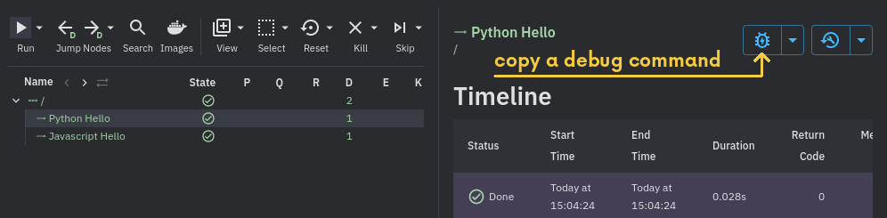

# co_snap

Is a utility for generating conducto screenshots.

## setup

eval the output of `co_snap_init` to stage necessary env vars

```bash
pip install -e .
eval "$(co_snap_init)"
```
## usage

- Ensure your pipeline is running and make note of its url
- Automate the creation of your screenshot like in [sample.py](sample.py)
- Run the screenshot automation script like so:
```python
python sample.py --url https://conducto.com/app/p/the-pip
```
- Expect images to be created

